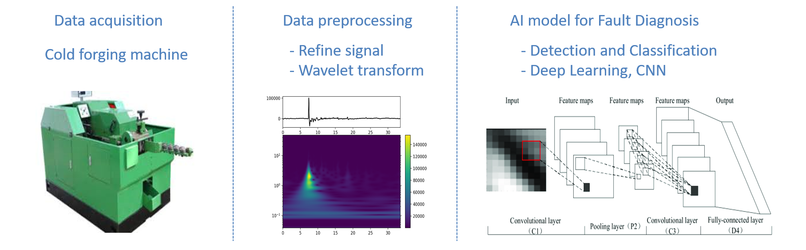
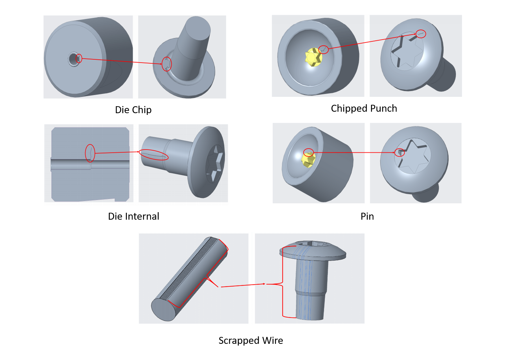
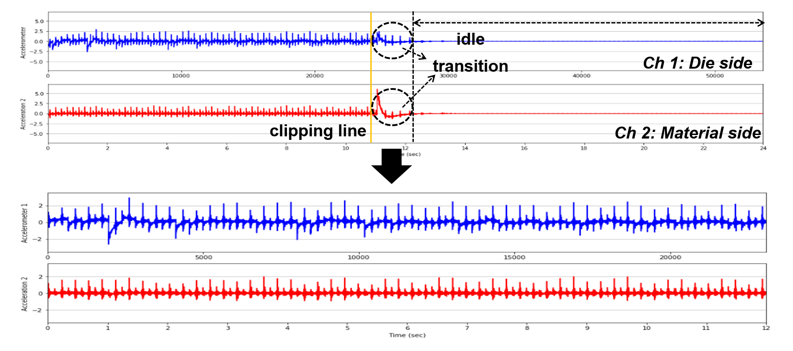
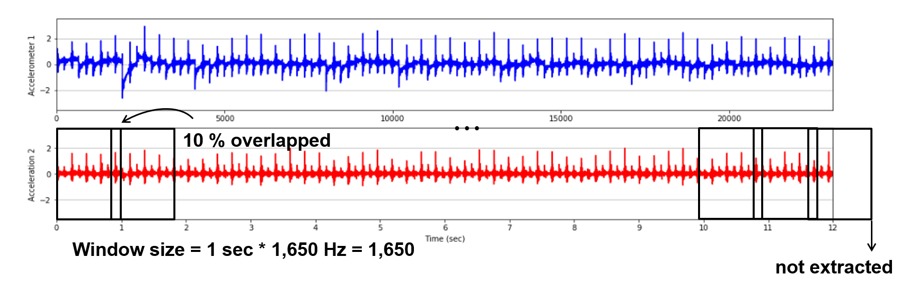
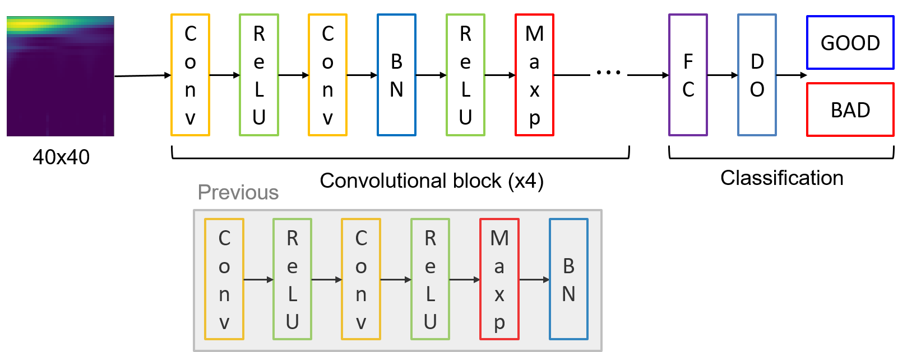
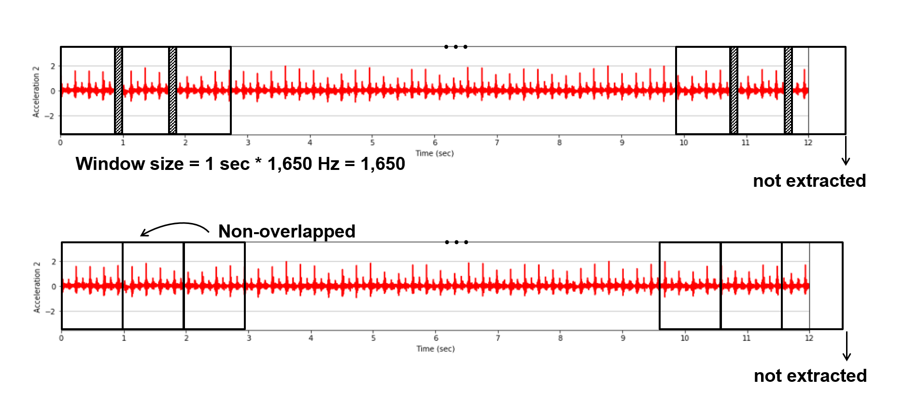
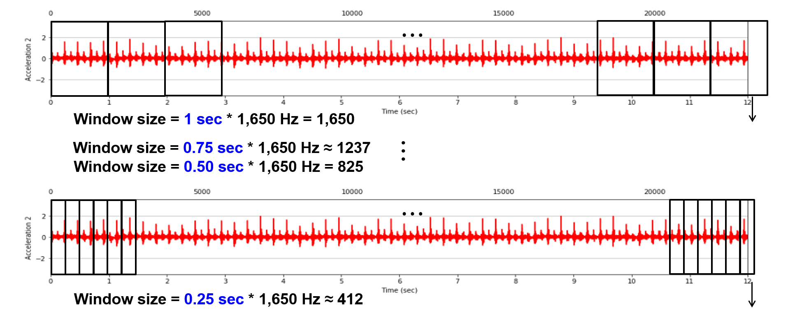
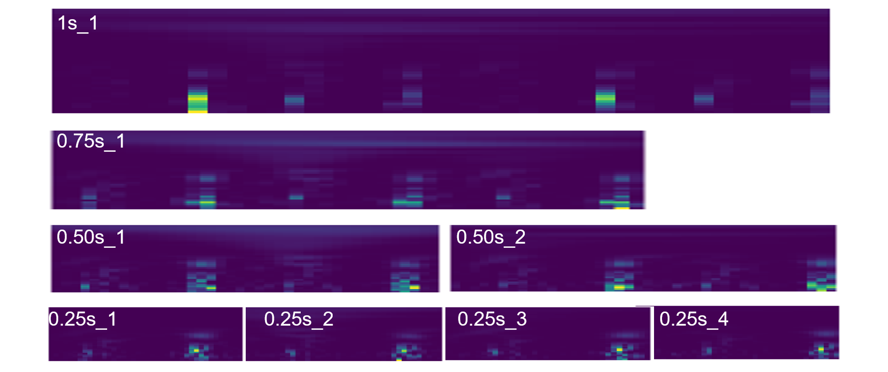
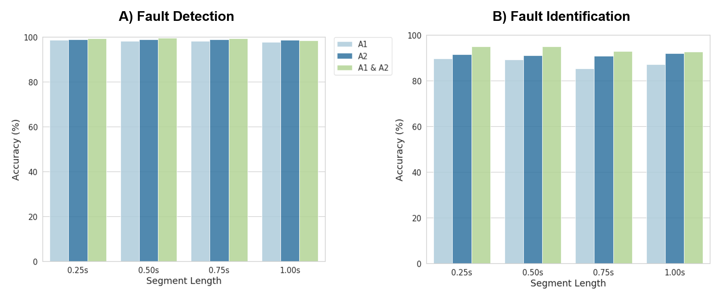
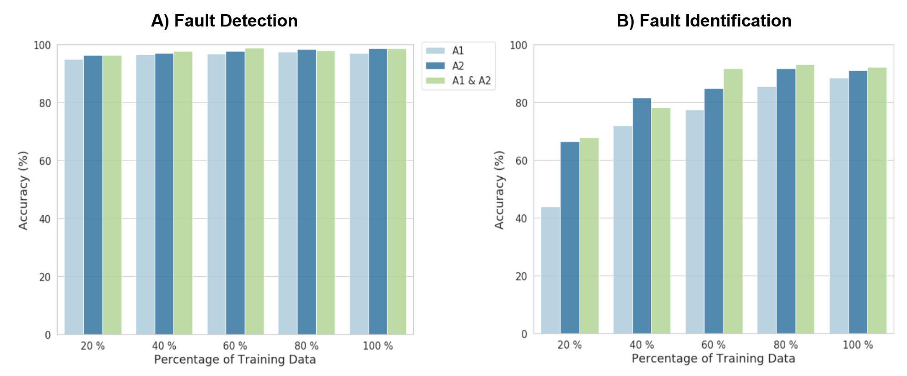

# IIoT- and AI-based Smart Substainable Manufacturing

- My part: Development of AI-based fault diagnosis system in cold forging process

## Outline

     <b> CNN-based fault diagnosis in cold forging process</b>  
     

## Experimental Data Collection

- Collaborated with Semblex Co. in Chicago, Illinois, US
- Data was acquisited under expermental condition
- 2 Acceleometer Sensors (Sampling Rate: 1650 Hz / One near the die side where forging happens, another one close to the material side where a wire is fed)
- Normal data under ordinary condition and 6 fault scenarioes (Heavy Oil, Die Punch, Scrapped Wire, Die Chip, Die Internal, and Pin)

     <b> Examples of Fault Cases </b>  
     

## Preprocessing

     <b> Clipping</b>  
     

 

     <b> Segmentation</b>  
     

 

     <b> Wavelet Transform</b>  
     

## 2D Convolutional Neural Network

- 2-phase fault diagnosis: fault detection (binary classification) and defect identification (multi-class classificiation)

     <b> CNN architecture</b>  
     

## Experiments

### Overlapping

     <b> 10 % Overlap and Non-overlap</b>  
     

 

     <b> Confusion Matrices according to overlapping</b>  
     

### Sample Length

     <b> Segmentation by Window Size</b>  
     

 

     <b> Wavelet Transform Images by Window Size</b>  
     

 

     <b> Performance by Window Size</b>  
     

### Number of Training Samples

     <b> Performance by Number of Training Samples</b>  
     

