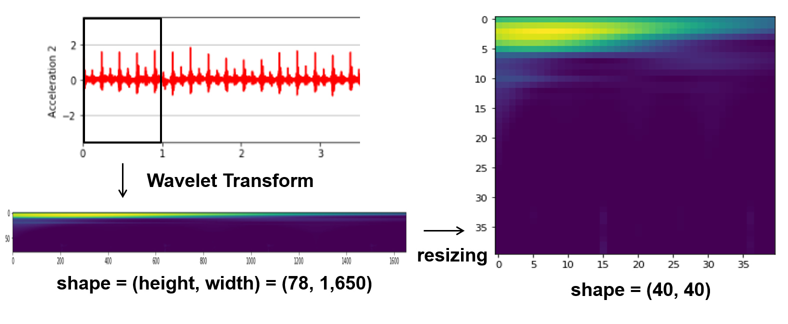

# IIoT- and AI-based Smart Substainable Manufacturing

- My part: Development of AI-based fault diagnosis system in cold forging process

## Outline

     <b> CNN-based fault diagnosis in cold forging process</b>  
     

## Experimental Data Collection

- Collaborated with Semblex Co. in Chicago, Illinois, US
- Data was acquisited under expermental condition
- 6 fault scenarioes (Heavy Oil, Die Punch, Scrapped Wire, Die Chip, Die Internal, and Pin)

     <b> Examples of Fault Cases </b>  
     

## Preprocessing

     <b> Clipping</b>  
     

 

     <b> Segmentation</b>  
     

 

     <b> Wavelet Transform</b>  
     

